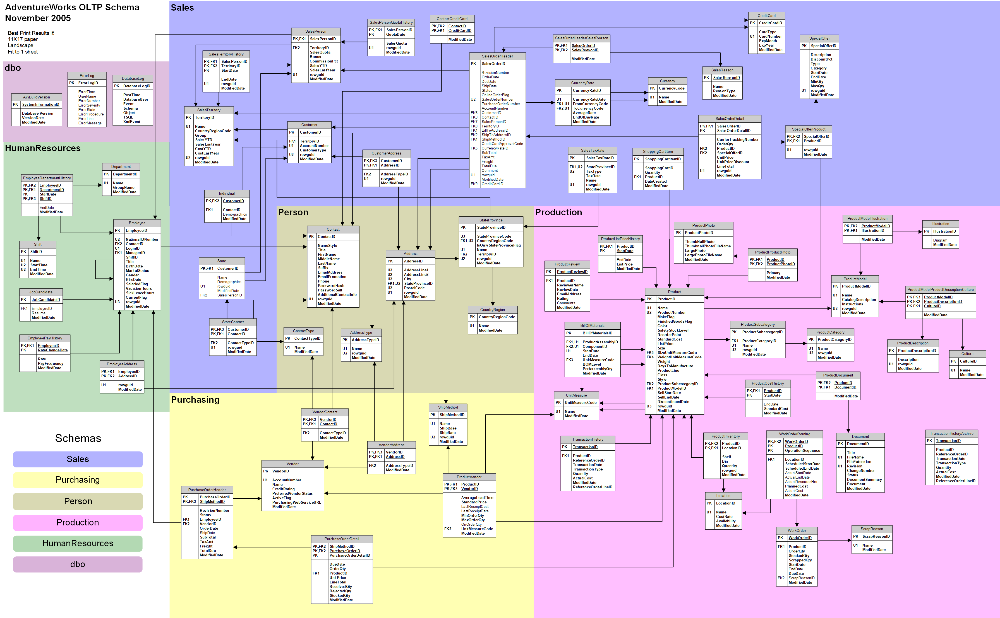

# Chuyên mục luyện SQL Command Line
## Giới thiệu sương sương:
### BT_CSDL.pdf:
- Trong file này sẽ là cốt lõi những gì mà chuyên mục này hướng tới là luyện khả năng tư duy khi gặp một yêu cầu truy vấn, điểm cộng trong bộ câu hỏi và bài tập này là chúng cũng cung cấp một lượng lớn câu hỏi có liên quan đến Bussiness giúp cho người học có một cái nhìn tổng quan về dataset của một doanh nghiệp điển hình cũng như các vấn đề thực tế khi người ta muốn tìm hiểu về dữ liệu để phục vụ cho nhu cầu phân tích số liệu.
### ERD.webp :
- File này cung cấp ERD của cơ sở dữ liệu AdventureWork các bạn có thể xem và tham khảo lược đồ để tiện cho việc truy vấn giữa nhiều bảng giúp tiết kiệm thời gian là không biết cột mình cần nó nằm ở phương trời nào ha 😜

### Thuốc độc:
- Thật ra nó là thuốc giải =))) cơ mà đã muốn cày cuốc thì ráng cố gắng cày hết khả năng của mình đi, khi nào thấy bấn lắm rồi thì mở nó ra và có thể nó sẽ khai sáng cho bạn đấy, còn bạn nào thích cheat cho xong sớm thì well :v cứ thoải mái mình cũng hong cấm 
### Link file backup của CSDL AdventureWork: 
- [link](https://learn.microsoft.com/en-us/sql/samples/adventureworks-install-configure?view=sql-server-ver16&tabs=ssms)
- Tải file AdventureWorks2019.bak sau đó làm theo hướng dẫn như hướng dẫn bên trong link này luôn là có csdl để dùng nhoé
### Yêu cầu:
- SQL server: cái này thì phiên bản nào cũng được nhé mà mình recommend dùng SQL Server 2019 bản Dev
- Tinh thần thép 🤞 này thêm cho zui thui hihi
## Lấn cấn liên hệ: https://www.facebook.com/hoanqthinh.404/
# 👾 Thank you guys chúc mọi người cày cuốc vui vẻ